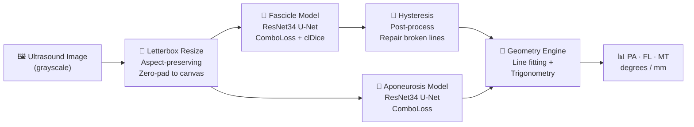
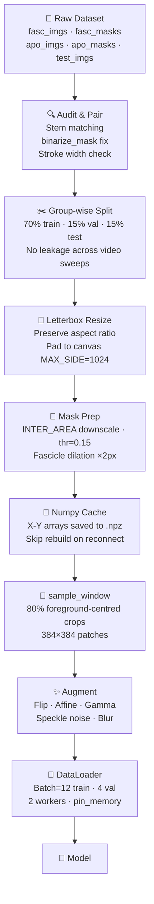
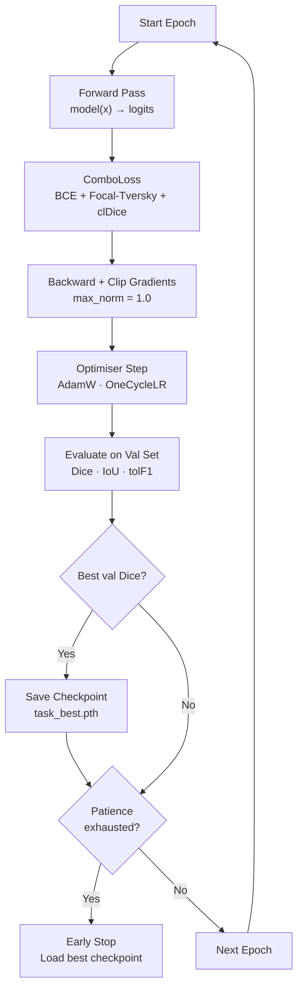

# Diagram 1 — Full Pipeline Overview

```mermaid
flowchart LR
    A["🖼️ Ultrasound Image\n(grayscale)"]
    B["📐 Letterbox Resize\nAspect-preserving\nZero-pad to canvas"]
    C["🧠 Fascicle Model\nResNet34 U-Net\nComboLoss + clDice"]
    D["🧠 Aponeurosis Model\nResNet34 U-Net\nComboLoss"]
    E["🔧 Hysteresis\nPost-process\nRepair broken lines"]
    F["📐 Geometry Engine\nLine fitting +\nTrigonometry"]
    G["📊 PA · FL · MT\ndegrees / mm"]

    A --> B
    B --> C
    B --> D
    C --> E
    E --> F
    D --> F
    F --> G
```

---

# Diagram 2 — Data Pipeline

```mermaid
flowchart TD
    RAW["📁 Raw Dataset\nfasc_imgs · fasc_masks\napo_imgs · apo_masks · test_imgs"]
    AUDIT["🔍 Audit & Pair\nStem matching\nbinarize_mask fix\nStroke width check"]
    SPLIT["✂️ Group-wise Split\n70% train · 15% val · 15% test\nNo leakage across video sweeps"]
    LETTER["📐 Letterbox Resize\nPreserve aspect ratio\nPad to canvas MAX_SIDE=1024"]
    MASK["🎯 Mask Prep\nINTER_AREA downscale · thr=0.15\nFascicle dilation ×2px"]
    CACHE["💾 Numpy Cache\nX-Y arrays saved to .npz\nSkip rebuild on reconnect"]
    WINDOW["🎲 sample_window\n80% foreground-centred crops\n384×384 patches"]
    AUG["✨ Augment\nFlip · Affine · Gamma\nSpeckle noise · Blur"]
    LOADER["🔄 DataLoader\nBatch=12 train · 4 val\n2 workers · pin_memory"]
    MODEL["🧠 Model"]

    RAW --> AUDIT --> SPLIT --> LETTER --> MASK --> CACHE --> WINDOW --> AUG --> LOADER --> MODEL
```

---

# Diagram 3 — Training Loop

```mermaid
flowchart TD
    START["Start Epoch"]
    FORWARD["Forward Pass\nmodel(x) → logits"]
    LOSS["ComboLoss\nBCE + Focal-Tversky + clDice"]
    BACKWARD["Backward + Clip Gradients\nmax_norm = 1.0"]
    STEP["Optimiser Step\nAdamW · OneCycleLR"]
    EVAL["Evaluate on Val Set\nDice · IoU · tolF1"]
    BEST{"Best val Dice?"}
    SAVE["Save Checkpoint\ntask_best.pth"]
    PATIENCE{"Patience\nexhausted?"}
    STOP["Early Stop\nLoad best checkpoint"]
    NEXT["Next Epoch"]

    START --> FORWARD --> LOSS --> BACKWARD --> STEP --> EVAL --> BEST
    BEST -- Yes --> SAVE --> PATIENCE
    BEST -- No --> PATIENCE
    PATIENCE -- Yes --> STOP
    PATIENCE -- No --> NEXT --> START
```
