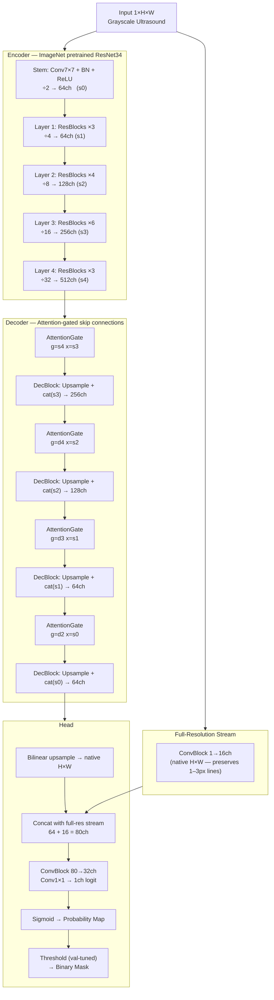
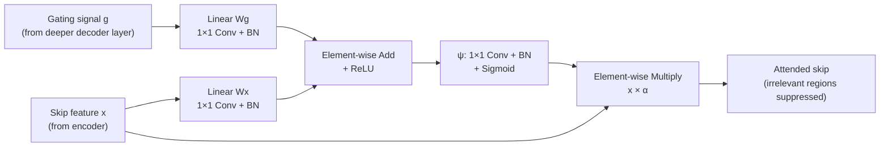

# Diagram 4 — Model Architecture (ResNet34 Attention U-Net)

```mermaid
flowchart TD
    INPUT["Input 1×H×W\nGrayscale Ultrasound"]

    subgraph ENCODER["Encoder — ImageNet pretrained ResNet34"]
        STEM["Stem: Conv7×7 + BN + ReLU\n÷2 → 64ch   (s0)"]
        L1["Layer 1: ResBlocks ×3\n÷4 → 64ch   (s1)"]
        L2["Layer 2: ResBlocks ×4\n÷8 → 128ch  (s2)"]
        L3["Layer 3: ResBlocks ×6\n÷16 → 256ch (s3)"]
        L4["Layer 4: ResBlocks ×3\n÷32 → 512ch (s4)"]
        STEM --> L1 --> L2 --> L3 --> L4
    end

    subgraph HRSTREAM["Full-Resolution Stream"]
        HR["ConvBlock 1→16ch\n(native H×W — preserves 1–3px lines)"]
    end

    subgraph DECODER["Decoder — Attention-gated skip connections"]
        AG3["AttentionGate\ng=s4  x=s3"]
        D4["DecBlock: Upsample + cat(s3) → 256ch"]
        AG2["AttentionGate\ng=d4  x=s2"]
        D3["DecBlock: Upsample + cat(s2) → 128ch"]
        AG1["AttentionGate\ng=d3  x=s1"]
        D2["DecBlock: Upsample + cat(s1) → 64ch"]
        AG0["AttentionGate\ng=d2  x=s0"]
        D1["DecBlock: Upsample + cat(s0) → 64ch"]
        AG3 --> D4 --> AG2 --> D3 --> AG1 --> D2 --> AG0 --> D1
    end

    subgraph HEAD["Head"]
        UPSAMP["Bilinear upsample → native H×W"]
        CONCAT["Concat with full-res stream\n64 + 16 = 80ch"]
        CONV["ConvBlock 80→32ch\nConv1×1 → 1ch logit"]
        SIG["Sigmoid → Probability Map"]
        THR["Threshold (val-tuned)\n→ Binary Mask"]
        UPSAMP --> CONCAT --> CONV --> SIG --> THR
    end

    INPUT --> ENCODER
    INPUT --> HRSTREAM
    L4 --> DECODER
    D1 --> HEAD
    HRSTREAM --> CONCAT
```

---

# Diagram 5 — Attention Gate Detail

```mermaid
flowchart LR
    G["Gating signal g\n(from deeper decoder layer)"]
    X["Skip feature x\n(from encoder)"]
    WG["Linear Wg\n1×1 Conv + BN"]
    WX["Linear Wx\n1×1 Conv + BN"]
    ADD["Element-wise Add\n+ ReLU"]
    PSI["ψ: 1×1 Conv + BN\n+ Sigmoid"]
    MUL["Element-wise Multiply\nx × α"]
    OUT["Attended skip\n(irrelevant regions suppressed)"]

    G --> WG
    X --> WX
    WG --> ADD
    WX --> ADD
    ADD --> PSI
    PSI --> MUL
    X --> MUL
    MUL --> OUT
```
