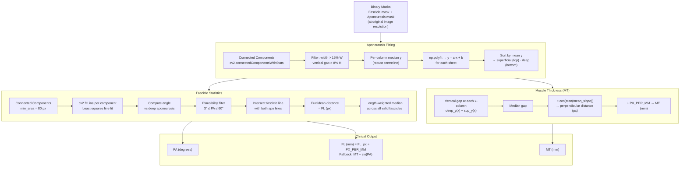
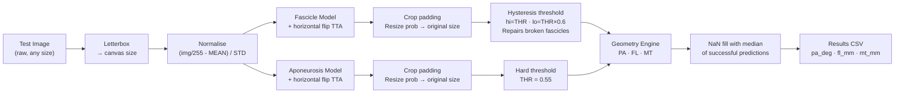

# Diagram 6 — Geometry Engine

```mermaid
flowchart TD
    MASKS["Binary Masks\nFascicle mask + Aponeurosis mask\n(at original image resolution)"]

    subgraph APO["Aponeurosis Fitting"]
        CC["Connected Components\ncv2.connectedComponentsWithStats"]
        FILTER["Filter: width > 15% W\nvertical gap > 8% H"]
        MEDIAN["Per-column median y\n(robust centreline)"]
        POLYFIT["np.polyfit → y = a·x + b\nfor each sheet"]
        SORT["Sort by mean y\n→ superficial (top) · deep (bottom)"]
        CC --> FILTER --> MEDIAN --> POLYFIT --> SORT
    end

    subgraph MT_CALC["Muscle Thickness (MT)"]
        GAP["Vertical gap at each x-column\ndeep_y(x) − sup_y(x)"]
        MEDIAN_GAP["Median gap"]
        PERP["× cos(atan(mean_slope))\n→ perpendicular distance (px)"]
        MM_MT["÷ PX_PER_MM → MT (mm)"]
        GAP --> MEDIAN_GAP --> PERP --> MM_MT
    end

    subgraph FASC["Fascicle Statistics"]
        FCOMP["Connected Components\nmin_area = 80 px"]
        FITLINE["cv2.fitLine per component\nLeast-squares line fit"]
        ANGLE["Compute angle\nvs deep aponeurosis"]
        PLAUS["Plausibility filter\n3° ≤ PA ≤ 60°"]
        INTERSECT["Intersect fascicle line\nwith both apo lines"]
        FL_PX["Euclidean distance\n= FL (px)"]
        AGGR["Length-weighted median\nacross all valid fascicles"]
        FCOMP --> FITLINE --> ANGLE --> PLAUS --> INTERSECT --> FL_PX --> AGGR
    end

    subgraph OUTPUT["Clinical Output"]
        PA["PA (degrees)"]
        FL["FL (mm) = FL_px ÷ PX_PER_MM\nFallback: MT ÷ sin(PA)"]
        MT["MT (mm)"]
    end

    MASKS --> APO
    APO --> MT_CALC
    APO --> FASC
    MT_CALC --> MT
    FASC --> PA
    FASC --> FL
```

---

# Diagram 7 — Inference Pipeline

```mermaid
flowchart LR
    IMG["Test Image\n(raw, any size)"]
    LB["Letterbox\n→ canvas size"]
    NORM["Normalise\n(img/255 - MEAN) / STD"]
    PRED_F["Fascicle Model\n+ horizontal flip TTA"]
    PRED_A["Aponeurosis Model\n+ horizontal flip TTA"]
    CROP_F["Crop padding\nResize prob → original size"]
    CROP_A["Crop padding\nResize prob → original size"]
    HYST["Hysteresis threshold\nhi=THR · lo=THR×0.6\nRepairs broken fascicles"]
    HARD["Hard threshold\nTHR = 0.55"]
    GEOM["Geometry Engine\nPA · FL · MT"]
    NAN["NaN fill with median\nof successful predictions"]
    OUT["Results CSV\npa_deg · fl_mm · mt_mm"]

    IMG --> LB --> NORM
    NORM --> PRED_F --> CROP_F --> HYST --> GEOM
    NORM --> PRED_A --> CROP_A --> HARD --> GEOM
    GEOM --> NAN --> OUT
```
